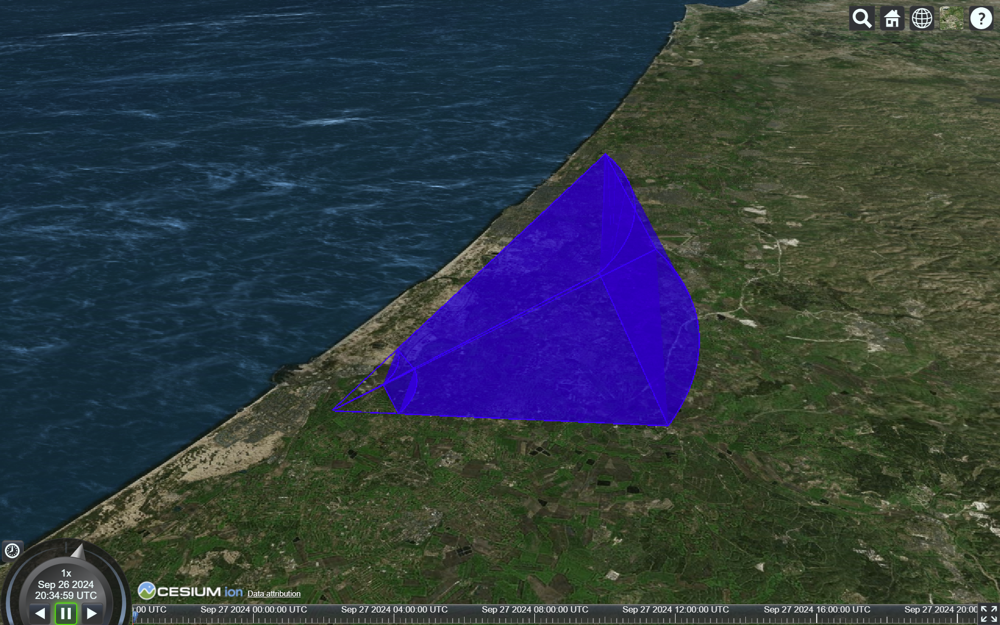

# czml3-ext

This library is a collection of functions that outputs `list`s of `czml3.packet`s for various items, as shown in the table below. See [czml3](https://github.com/poliastro/czml3) for more information about CZML properties.

| Item     | Function in `czml3_ext`                                |
| -------- | ------------------------------------------------------ |
| Sensor   | `packets.sensor_polyline` and `packets.sensor_polygon` |
| Grid     | `packets.grid`                                         |
| Border   | `packets.border`                                       |
| Viewshed | `packets.coverage`                                     |

## Installation
`pip install czml3-ext`

## Examples
See the example [notebook](examples/examples.ipynb) for a full demo of the package. Run `pip install czml3_ext[examples]` to run the examples locally.

The following code produces a CZML file with a sensor:
```
import numpy as np
from czml3 import Document, Preamble
from czml3_ext import packets

sensor_polygon = packets.sensor_polygon(
    np.array([[31.8], [34.68], [0]]), 90, 30, 50, 20, 20_000, 5_000
)
sensor_polyline = packets.sensor_polyline(
    np.array([[31.8], [34.68], [0]]), 90, 30, 50, 20, 20_000, 5_000
)

doc = Document([Preamble(name="simple")] + sensor_polygon + sensor_polyline)
with open("tmp.czml", "w") as f:
    doc.dump(f)
```

This produces the following view:


## Contributing
PRs are always welcome and appreciated!

After forking the repo install the dev requirements: `pip install -e .[dev]`.
